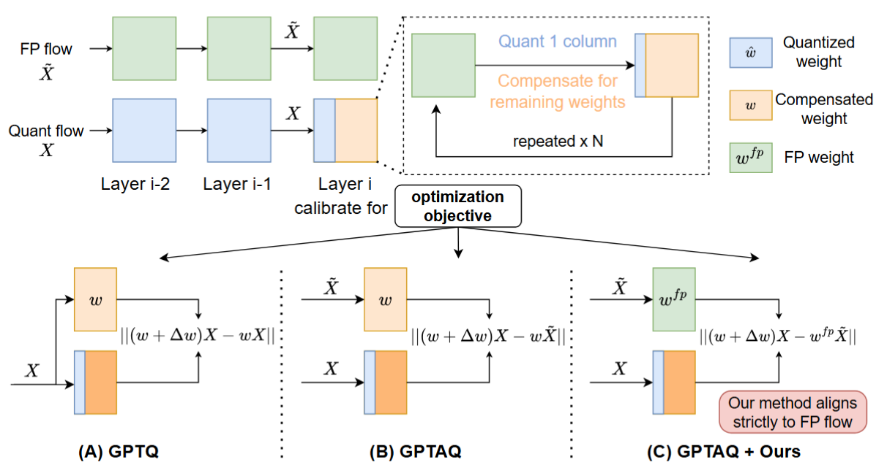

# Rethinking Residual Errors in Compensation-based LLM Quantization [ICLR'26]

## Motivation

We identify the missing residual error term ( We name it 'Compensation-aware Error' ) in GPTAQ, which comes the discrepancy between compensated and original weights. Therefore, our method strictly aligns with the original full-precision ouput at each column.

## Scripts
Our codebase is heavily relied on GPTAQ, with simple modifications. Please see `fake_quant/gptaq_utils_r.py` for details.

Take weight-only quantization as an example:
```
cd fake_quant
bash weight_group_3bit.sh  ### per-group quantization
bash weight_group_2bit.sh  ### Quarot + per-group quantization
```

## Todo List
I'm continuously working on improving the stability of ResComp. Since we form a more precise optimization objective, and we only use 128 samples, it may be more sensitive to the quality of calibration data. I warmly welcome further discussions, feel free to contact me (list@zju.edu.cn).

## Acknowledgements
Our codebase is built heavily on previous works, and we would like to acknowledge and thank their awesome contribution: 
+ GPTAQ: Efficient finetuning-free quantization for asymmetric calibration [github](https://github.com/Intelligent-Computing-Lab-Panda/GPTAQ)
+ GPTQ: Accurate post-training quantization for generative pre-trained transformers [github](https://github.com/IST-DASLab/gptq)
+ QuaRot: Outlier-free 4-bit inference in rotated llms [github](https://github.com/spcl/QuaRot)
+ SpinQuant: Llm quantization with learned rotations [github](https://github.com/facebookresearch/SpinQuant/)

## Citation

If you find our work useful in your research, please kindly cite this paper:

```
@inproceedings{lirethinking,
  title={Rethinking Residual Errors in Compensation-based LLM Quantization},
  author={Li, Shuaiting and Deng, Juncan and Xu, Kedong and Deng, Rongtao and Gu, Hong and Jiang, Minghan and Shen, Haibin and Huang, Kejie},
  booktitle={The Fourteenth International Conference on Learning Representations}
}
```

Besides, if you are interested in vector quantization, checkout our previous papers: [SSVQ](https://openaccess.thecvf.com/content/ICCV2025/html/Li_SSVQ_Unleashing_the_Potential_of_Vector_Quantization_with_Sign-Splitting_ICCV_2025_paper.html) [ICCV'25], [MVQ](https://dl.acm.org/doi/abs/10.1145/3669940.3707268) [ASPLOS'25], [VQ4DiT] (https://ojs.aaai.org/index.php/AAAI/article/view/33782) [AAAI'25], [ViM-VQ] (https://openaccess.thecvf.com/content/ICCV2025/html/Deng_ViM-VQ_Efficient_Post-Training_Vector_Quantization_for_Visual_Mamba_ICCV_2025_paper.html) [ICCV'25]. I'm also seeking collabration opportunity in CUDA kernel optimization to better support SSVQ.
